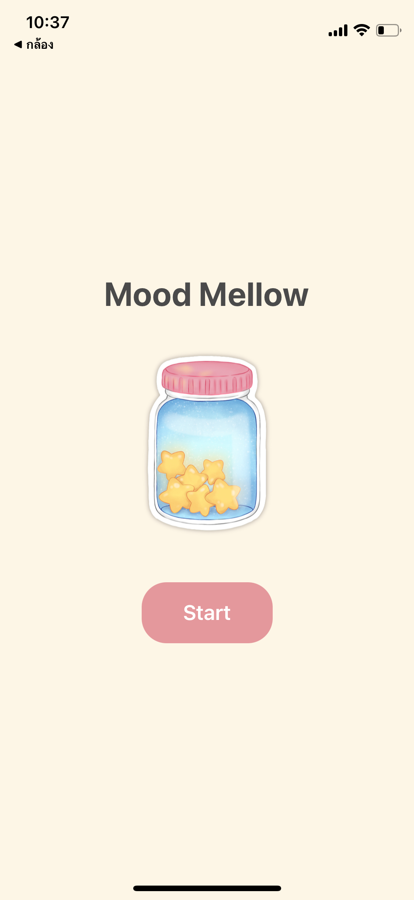
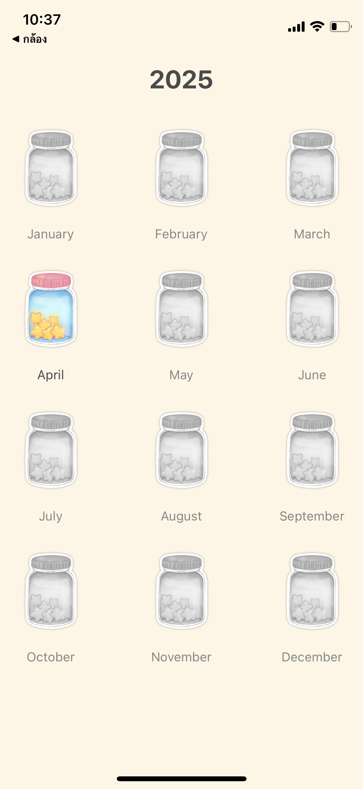
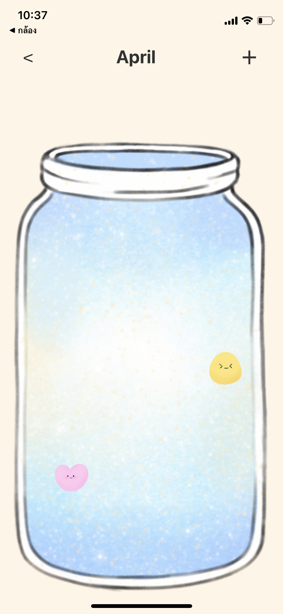
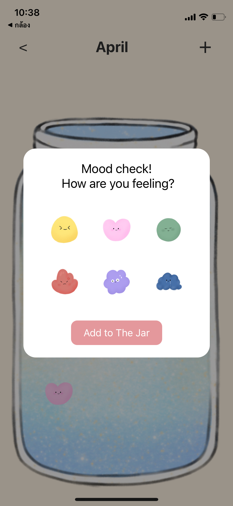

# MoodMellow
Final Exam : Mobile Application Development

Name : Chayanit Triroj
Student ID : 6631503010
App Name: MoodMellow
Framework Used : React Native 
GitHub Repository:
(APK/IPA):

MoodMellow : This app serves as an emotional diary for users, allowing them to "drop" the feelings they experience into a "monthly jar" to record their emotions throughout the year. It offers a fun, cute, and easy-to-use way to collect and reflect on one's emotions over time.

# App Development Report

## 1. App Design

### 1.1 User Personas
- Name: Chayanit Triroj
- Age: 20 years old
- Need: I want to see an overview of my emotions each month to better manage them.

### 1.2 App Goals
The app allows users to record their emotions by selecting an emotion icon instead of typing text and placing it into a monthly jar.
- It acts as a "feelings diary jar" so that users can easily view their overall emotions.
- Aims to help users recognize and manage their emotional patterns.
- Focused on being simple to use and visually engaging with interesting graphics.

### 1.3 Screen Layout
- **Home Screen**: The starting page of the app.

- **Yearly Jar Screen**: Displays an overview of jars for each month (currently only April is accessible).

- **Monthly Jar Screen (April)**: Shows the user's emotions recorded for April.

### 1.4 User Flow
Open the app > View the Yearly Jar Screen > Select a month > View the emotion summary for that month > Add new emotions as needed.

## 2. App Development

### 2.1 Development Details
- Built with React Native and JavaScript
- Used packages: React Navigation, Modal, ImageBackground, TouchableOpacity

### 2.2 Developed Features
- Display shelves with 12 monthly jars (only April is selectable).
- Display the selected month's jar with the ability to add emotions.
- Open a pop-up window (Modal) to choose an emotion from a set of cute graphics.
- Save and display the added emotions inside the jar.

## 3. Reflection
- **Challenges**: Managing the opening/closing of the pop-up window and sending selected emotion data back to the main screen.
- **Learning**: Gained experience in using Modal components to create pop-ups in React Native.

## 4. AI-Assisted Development
- Used AI to generate a basic structure of the app first, then replaced placeholder graphics with customized designs.
- Also used AI to solve minor issues during development.

